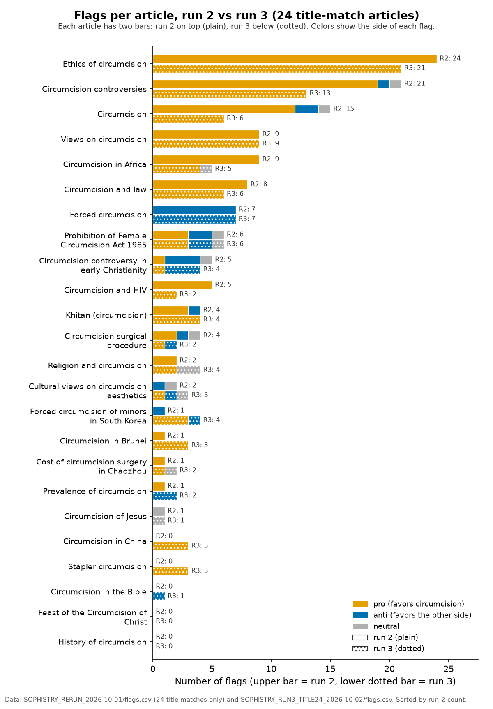
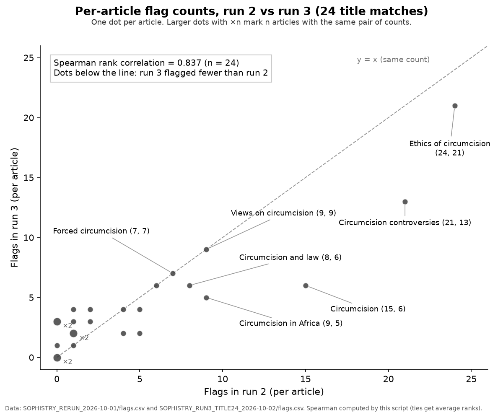
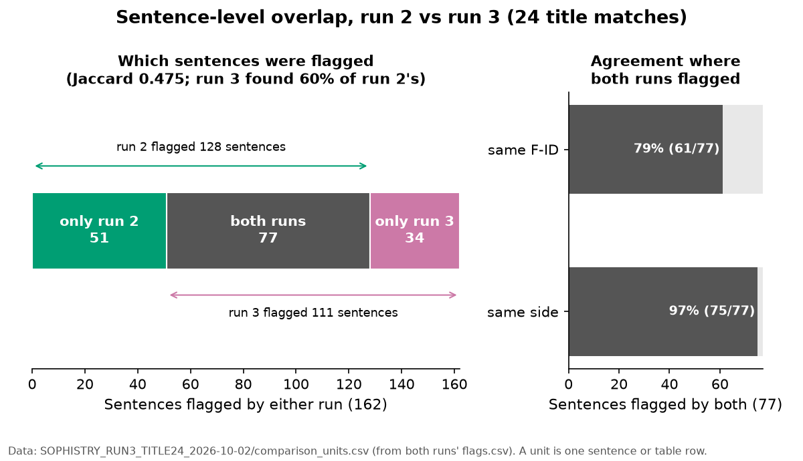
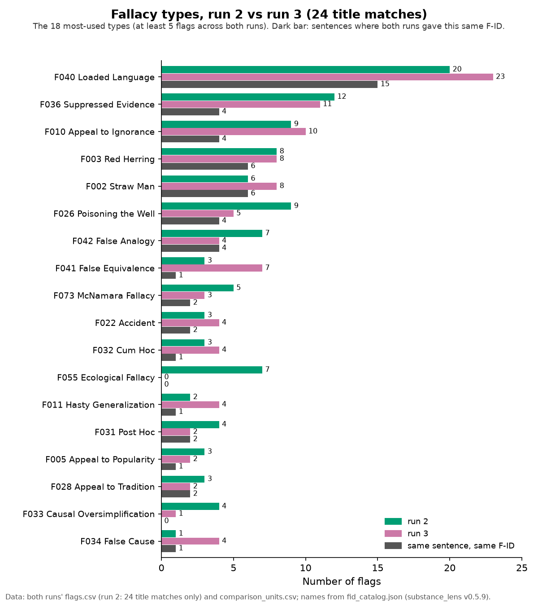

# grokipedia-truth-audit

Audits of Grokipedia articles, done on saved snapshots so every finding can be traced to the text that was read. So far: 58 circumcision-related articles (2026-10-01 snapshots) and the Baruch Spinoza article.

## Why this repo exists

Grokipedia is xAI's AI-written encyclopedia. It went live on 27 Oct 2025; the week before, Elon Musk said the launch was delayed "to do more work to purge out the propaganda" ([WIRED](https://www.wired.com/story/elon-musk-launches-grokipedia-wikipedia-competitor/)). This repo checks how its articles reason and cite sources, and publishes the snapshots, flags and scripts so the work can be checked. Every flag is a model's judgment, not a fact-check (see [Caveats](#caveats)).

## Circumcision articles: sophistry scan (2026-10-01)

Run 2 read every sentence of the 58 articles against the [substance_lens](https://github.com/neuresthetics/substance_lens) v0.5.9 fallacy catalogue and flagged reasoning faults, each tagged by the side it favors.

| Measure | Result |
|---|---|
| Sentences read | all 10,258 units in 58 articles (100%) |
| Flags (pro / anti / neutral) | 225 (154 / 49 / 22) |
| Male-circumcision articles (39): pro / anti / neutral | 123 / 22 / 9 (85% of sided flags pro) |
| FGM articles (19): pro / anti / neutral | 31 / 27 / 13 (53% of sided flags pro; one article supplies 14 of the 31) |

Side of each flag, by run. Pro share of sided flags: run 1 69.2% and run 2 75.9% (all 58 articles); run 2 84.0% and run 3 82.7% (24 title matches). The 85% above counts only the 39 male-circumcision articles (run 1: 77%).

### Flags by fallacy type

Counted from run 2's flag file. In FGM articles, "pro" means the flag favors cutting or a male/female distinction.

| Fallacy (engine ID) | Total | Pro | Anti | Neutral |
|---|---|---|---|---|
| F040 Loaded Language | 37 | 28 | 9 | 0 |
| F036 Suppressed Evidence | 26 | 21 | 3 | 2 |
| F032 Cum Hoc | 15 | 5 | 1 | 9 |
| F011 Hasty Generalization | 14 | 10 | 2 | 2 |
| F026 Poisoning the Well | 14 | 10 | 3 | 1 |
| F010 Appeal to Ignorance | 13 | 7 | 3 | 3 |
| F031 Post Hoc | 12 | 3 | 7 | 2 |
| F002 Straw Man | 10 | 7 | 3 | 0 |
| F003 Red Herring | 10 | 10 | 0 | 0 |
| F001 Ad Hominem | 8 | 6 | 2 | 0 |
| F034 False Cause | 8 | 2 | 6 | 0 |
| F042 False Analogy | 8 | 8 | 0 | 0 |
| F055 Ecological Fallacy | 7 | 5 | 2 | 0 |
| F033 Causal Oversimplification | 6 | 3 | 3 | 0 |
| F073 McNamara Fallacy | 5 | 4 | 0 | 1 |
| F013 False Dilemma | 4 | 4 | 0 | 0 |
| F028 Appeal to Tradition | 4 | 4 | 0 | 0 |
| F005 Appeal to Popularity | 3 | 2 | 1 | 0 |
| F022 Accident | 3 | 3 | 0 | 0 |
| F027 Genetic Fallacy | 3 | 2 | 1 | 0 |
| F041 False Equivalence | 3 | 0 | 2 | 1 |
| F004 Appeal to Authority | 2 | 0 | 1 | 1 |
| F025 Guilt by Association | 2 | 2 | 0 | 0 |
| F039 No True Scotsman | 2 | 2 | 0 | 0 |
| Six types with 1 pro flag each: F019 Composition, F035 Texas Sharpshooter, F053 Argument from Repetition, F056 Exception Fallacy, F061 Is-Ought Jump, F077 Fallacy of Relative Privation | 6 | 6 | 0 | 0 |
| **Total** | **225** | **154** | **49** | **22** |

- All flags with exact quotes: [flags.csv](articles/SOPHISTRY_RERUN_2026-10-01/flags.csv)
- Run 1 (partial read) vs run 2: [COMPARISON.md](articles/SOPHISTRY_RERUN_2026-10-01/COMPARISON.md)
- The 58 articles, with links and why each was included: [ARTICLE_LIST.md](articles/ARTICLE_LIST.md) (counts and dates: [INDEX_circumcision_related.md](articles/INDEX_circumcision_related.md))

### Replication: three-phase test (2026-10-02)

Run 1 read about 30% of sentences. Run 2 is the full read above. Run 3 was a second blind full read of the 24 articles with "circumcision" in the title, compared with run 2 on those 24.

| On the 24 title-match articles | Run 2 | Run 3 |
|---|---|---|
| Flags (pro / anti / neutral) | 126 (100 / 19 / 7) | 111 (86 / 18 / 7) |
| Pro share of sided flags | 84.0% | 82.7% |

The pro lean and the ranking of the most-flagged articles held up: per-article counts correlate at 0.837 (Spearman), and 17 of the 24 articles got the same lean, with every mismatch on an article with 4 or fewer flags. Only 60% of run 2's flagged sentences were flagged again, though when both runs flagged a sentence they agreed on its side 97% of the time. So individual flags are leads to check by hand.

Flags per article on the 24 title matches: run 2 on the upper bar, run 3 on the lower dotted bar, colored by side.

Per-article flag counts in run 2 against run 3, one dot per article (Spearman 0.837, n = 24).

Of 162 sentences flagged by either run, 77 were flagged by both, 51 by run 2 only and 34 by run 3 only; on the 77, the side matched 75 times and the F-ID 61 times.

The 18 most-used fallacy types on the 24 title matches (at least 5 flags across both runs; four types tie at 5). Dark bar: same sentence given the same F-ID by both runs.

- How the three runs were done, and what the test does and doesn't show: [METHOD_THREE_PHASE_TEST.md](METHOD_THREE_PHASE_TEST.md)
- Run 3 flags, scripts and full comparison: [articles/SOPHISTRY_RUN3_TITLE24_2026-10-02/](articles/SOPHISTRY_RUN3_TITLE24_2026-10-02/README.md)

### Re-running the scripts

- Charts: [tools/make_charts.py](tools/make_charts.py) draws all five from the committed flag files and prints every number it draws. Run `python3 tools/make_charts.py` from the repo root (needs matplotlib).
- Run 3's scripts run from the repo as they are (standard library only).
- Run 2's `build_flags.py` can't be re-run from the repo: its inputs (`raw_flags.tsv` and a local copy of the substance_lens spec) are not published, so `flags.csv` is the record. Run 2's `compare.py` needs the files `split.py` regenerates and a one-line filename change (Files section of [COMPARISON.md](articles/SOPHISTRY_RERUN_2026-10-01/COMPARISON.md)).

## Spinoza article: citation and fact check (2026-10-01)

A sentence-by-sentence check of the Baruch Spinoza article's citations and facts, using [tools/grokaudit](tools/grokaudit/README.md). From citation [90] onward the numbers appear shifted by nine places, so 110 of the 389 citation markers (28%) lead to an unrelated or missing source, in 97 of the 401 sentences. Of the 263 sentences checked against their sources or primary texts, 41 were judged to have a factual problem. Full report and counts: [spinoza_audit.md](articles/spinoza/analyses/2026-10-01/spinoza_audit.md).

## Caveats

- Every flag and verdict is a model's judgment. No human or independent model has checked the flags.
- All three scan runs used the same model family and method, so agreement between them shows consistency, not correctness.
- The scans don't fact-check: a flag says the article's own reasoning has a gap, not that the claim is false. Run 1's totals (partial read) are not comparable with the full reads.

## Repo layout

- `articles/<slug>/snapshots/`: verbatim copies of a Grokipedia article, named by date (YYYY-MM-DD).
- `articles/<slug>/analyses/<date>/`: analyses of that snapshot. For the 58 circumcision-related articles, `sophistry_scan.md` holds the run 2 flags and `sophistry_scan_run1_partial.md` the run 1 flags.
- `articles/<slug>/edit_submissions/`: correction drafts for Grokipedia (one so far: circumcision, 2025-11-30).
- `articles/SOPHISTRY_*`: run folders, run 1 summary, comparisons.
- `tools/`: scan, summary, audit and chart scripts. `docs/img/`: the charts.
- `background/`: essays on the underlying topic (not audits). `planning/`: candidate articles to audit next.
- `articles/circumcision/analyses/2025-11-30/` and `2026-02-25/`: earlier one-off model reviews of the Circumcision article, with no published method; not comparable with the scans.

Current articles: the 58 in [ARTICLE_LIST.md](articles/ARTICLE_LIST.md), and [spinoza](articles/spinoza/).

## Plans

Snapshot the same articles again later, re-scan them with the same method and compare flag counts by side (pro / anti / neutral) with these runs; audit more articles from [planning/candidate_articles.md](planning/candidate_articles.md).
