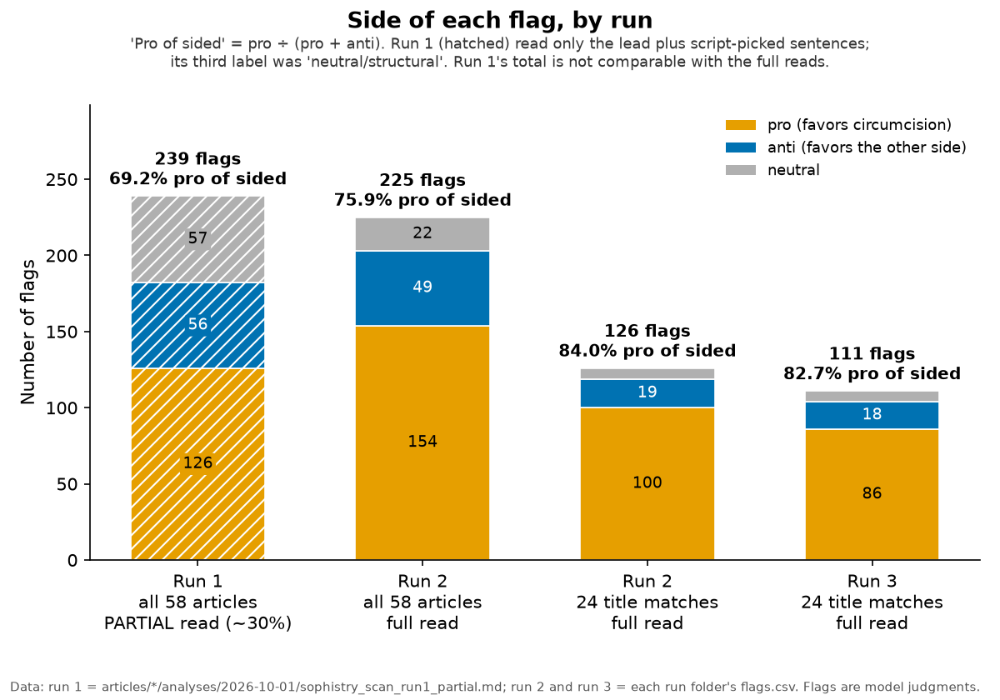

# grokipedia-truth-audit

Audits of Grokipedia articles, done on saved snapshots so every finding can be traced to the text that was read. Articles are grouped by topic; so far: 58 circumcision-related articles (2026-10-01 snapshots) and the Baruch Spinoza article.

## Where to find things

| Looking for | Go to |
|---|---|
| Results for one topic | `topics/<topic>/README.md` (see the table below) |
| The articles in a topic, with snapshot and live links | `topics/<topic>/ARTICLE_LIST.md` |
| A saved article and its audits | `topics/<topic>/articles/<slug>/` (`snapshots/`, `analyses/<date>/`, `edit_submissions/`) |
| Scan runs across a topic's articles | `topics/<topic>/runs/<date>_run<N>_<scope>/` |
| How the scans were tested | [docs/METHOD_THREE_PHASE_TEST.md](docs/METHOD_THREE_PHASE_TEST.md) |
| Charts | [docs/img/](docs/img/) |
| Scripts | [tools/](tools/README.md) |
| Adding a topic | [docs/ADDING_A_TOPIC.md](docs/ADDING_A_TOPIC.md) |

## Topics

| Topic | Articles | Latest run | Headline | Link |
|---|---|---|---|---|
| Circumcision | 58 | 2026-10-02: run 3, blind rescan of the 24 title-match articles | Full read (run 2): 225 flags, 154 pro / 49 anti / 22 neutral | [topics/circumcision/](topics/circumcision/README.md) |
| Spinoza | 1 | 2026-10-01: citation and fact check | 110 of 389 citation markers (28%) lead to an unrelated or missing source | [topics/spinoza/](topics/spinoza/README.md) |

## Why this repo exists

Grokipedia is xAI's AI-written encyclopedia. It went live on 27 Oct 2025; the week before, Elon Musk said the launch was delayed "to do more work to purge out the propaganda" ([WIRED](https://www.wired.com/story/elon-musk-launches-grokipedia-wikipedia-competitor/)). This repo checks how its articles reason and cite sources, and publishes the snapshots, flags and scripts so the work can be checked. Every flag is a model's judgment, not a fact-check (see [Caveats](#caveats)).

## Circumcision: sophistry scan

Run 2 read every sentence of the 58 articles against the [substance_lens](https://github.com/neuresthetics/substance_lens) v0.5.9 fallacy catalogue and flagged reasoning faults, each tagged by the side it favors: 225 flags, 154 pro / 49 anti / 22 neutral. A blind rescan of the 24 title-match articles (run 3) kept the pro lean (84.0% vs 82.7% of sided flags), but only 60% of run 2's flagged sentences were flagged again, so individual flags are leads to check by hand. Tables, charts and scripts: [topics/circumcision/](topics/circumcision/README.md).

## Spinoza: citation and fact check

From citation [90] onward the Baruch Spinoza article's numbers appear shifted by nine places, so 110 of the 389 citation markers (28%) lead to an unrelated or missing source. Of the 263 sentences judged (all priority sentences plus a seeded sample of 40), 41 were judged to have a factual problem. Details: [topics/spinoza/](topics/spinoza/README.md).

## Caveats

- Every flag and verdict is a model's judgment. No human or independent model has checked the flags.
- All three circumcision scan runs used the same model family and method, so agreement between them shows consistency, not correctness.
- The scans don't fact-check: a flag says the article's own reasoning has a gap, not that the claim is false. Run 1's totals (partial read) are not comparable with the full reads.

## Plans

Snapshot the same articles again later, re-scan them with the same method and compare flag counts by side (pro / anti / neutral) with these runs; audit more articles from [docs/CANDIDATE_ARTICLES.md](docs/CANDIDATE_ARTICLES.md); add more topics ([docs/ADDING_A_TOPIC.md](docs/ADDING_A_TOPIC.md)).
